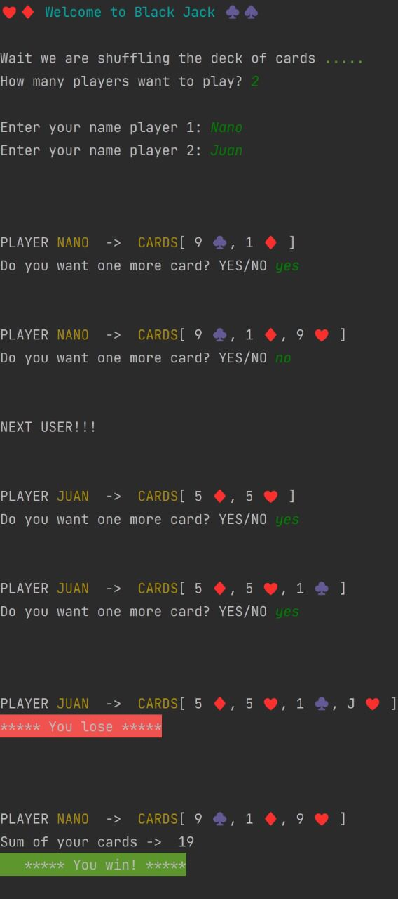

<h1 align="center"><b> App BlackJack </b></h1>
   

   
   

   

 

<b>Notes</b>

* Developer with Java 11.
* Is ready to be used.
* New version in development.

 

<b>Classic Blackjack Game For 2 or More Players</b>

* Create the cards.
* Create a deck.
* Shuffle the deck.
* Deal two cards to each player.
* If the sum of the dealt cards exceeds 21, it is warned that he lost.
* If it gives 21, it reports that I win.
* If the sum is less than 21, he asks if he wants one more card.
* At the end of the game, if anyone has reached 21, they will be told they have won, but if no one has reached 21, they
  will declare the winner who is closest to 21.

 

<b>Game Screen Print</b>

